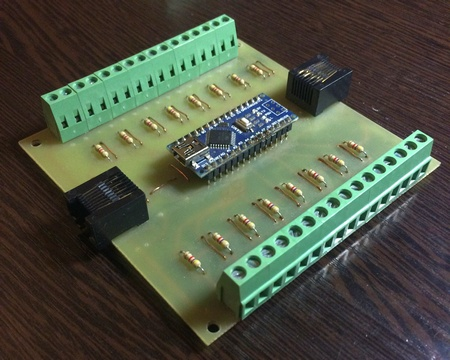
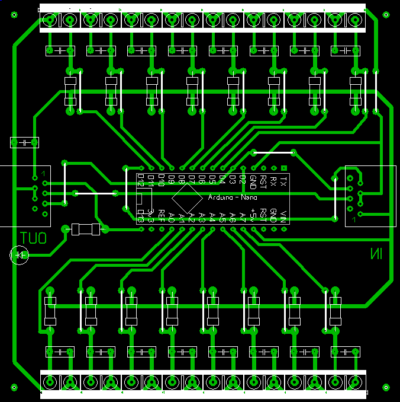
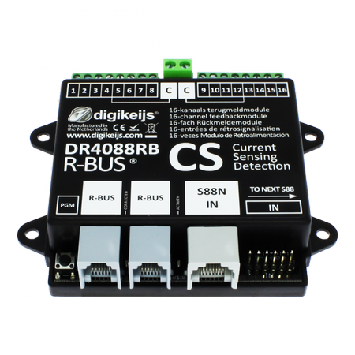
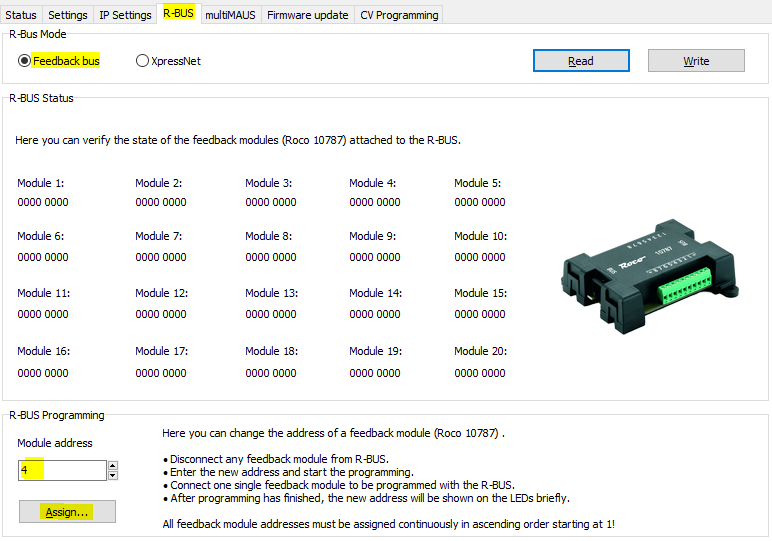

# S88-feedback-module
16 channel S88 feedback module

16-ти канальный модуль обратной связи на шине S88 для DCC железнодорожного моделизма

<p align="center">

</p>

## Всё что надо

|Наименование|Количество|
|:---:|:---:|
|Глянцевая бумага (лучше спец. бумага) А5|1
|Стеклотекстолит 100х100 мм	|1
|Хлорное железо	|1
|Изопропанол	|1
|Arduino Nano 3.0	|1
|Клеммник 3-контактный KLS2-128-5.00-03P-4S	|5
|Клеммник 2-контактный KLS2-128-5.00-02P-4S	|3
|Реле V23079A1001B301	|10
|Резистор 0.25 Вт, 4.7 кОм	|11
|Резистор 0.25 Вт, 10 кОм	|10
|Резистор 0.25 Вт, 1.5 кОм	|10
|Транзистор SS8050	|10
|Оптопара 6N136	|1
|Конденсатор 0.1 nF	|1
|Диод 1T4156	|1

## Схема для изготовления платы

- [AS88_V1.1.lay](AS88_V1.1.lay)
- В формате Sprint Layout.
- Используются перемычки чтобы не усложнять разводку.

<p align="center">

</p>

## Подключение и настройка

`Roco z21` :arrow_backward: `DR4088RB-CS` :arrow_backward: `s88 module`

1. [Roco z21](https://www.z21.eu/en/z21-system/the-models)

<p align="center">

</p>

2. [DR4088RB-CS 16-channel R-BUS™ feedback module](https://www.digikeijs.com/en/dr4088rb-cs-16-channel-r-bus-feedback-module.html) (opto version)

    [DR4088RB manual](https://support.digikeijs.com/hc/en-us/articles/360001762277-DR4088RB-Manuals) (pdf)

<p align="center">

</p>

3. S88 module

<p align="center">

</p>

4. Соеденить `Roco z21` и `DR4088RB-CS` с помощью `6-ти жильного кабеля`

    |S88|RJ-45|Arduino|Описание|
    |:---:|:---:|:---:| --- |
    | 1   | 2   | 13  | Data OUT |
    | 2   | 3,5 | GND | GND |
    | 3   | 4   | 2   | Clock |
    | 4   | 6   | 3   | PS  |
    | 5   | 7   | 12  | Reset (**not used**  in Arduino - pin 12 used as DATA IN from previous DATA OUT |
    | 6   | 1   | 5V  | V+ (Arduino 5V) |

5. Нажать кнопку `DR4088RB-CS` **два раза**:

    Светодиод `Green` (Programming indication) переходит в режим индикаци:
    ```
    long-ON ... short-OFF ... long-ON ... short-OFF
    ```

6. Запустить [Z21 Maintance Tool](https://www.z21.eu/en/products/z21-maintenance-tool):
- Закладка `R-Bus`
- Ввести `4` для **одного модуля после**, а для, например, четырёх после ввести 10 (кратное 2 - количество модулей обратной связи на плате)
- `Assign`

<p align="center">

</p>

6. Соеденить `DR4088RB-CS` и `S88 модуль` прямым RJ-45 кабелем.

## Пример адресации

Для второго добавленного декодера с модулями 3 и 4

| Модуль №   | Arduino | Rocrail |
| :---: |:---: |:---: |
| 3  | A0  | 17  |
|    | A1  | 18  |
|    | A2  | 19  |
|    | A3  | 20  |
|    | A4  | 21  |
|    | A5  | 22  |
|    | A6  | 23  |
|    | A7  | 24  |
| 4  | D4  | 25  |
|    | D5  | 26  |
|    | D6  | 27  |
|    | D7  | 28  |
|    | D8  | 29  |
|    | D9  | 30  |
|    | D10 | 31  |
|    | D11 | 32  |